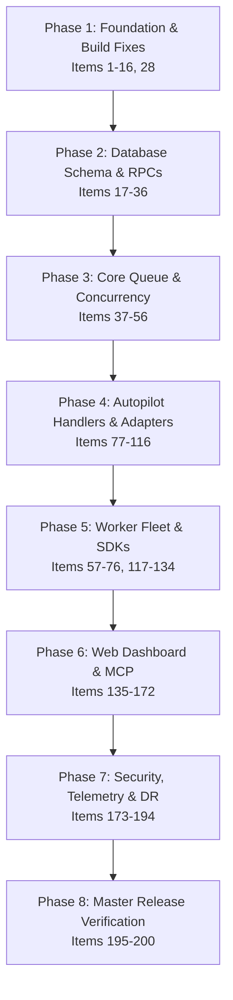

# JobForge Full Release Closure: Top 200 Priority Roadmap & Gap Analysis

**Version:** 1.0.0-GA-READINESS  
**Date:** 2026-09-12  
**Target Audiences:**
1. **AI Agent Systems Engineers**: Need deterministic job routing, trace replays, stateful execution, multi-agent orchestration, and real tool execution.
2. **Multi-Tenant SaaS Platform Architects**: Need ironclad tenant isolation (RLS), quota metering, API key auth, audit trails, and zero noisy-neighbor starvation.
3. **Worker Fleet Operators & DevOps / SREs**: Need reliable claim mechanics, heartbeat reclamation, horizontal worker autoscaling, OTel telemetry, and cross-platform builds.
4. **SDK & API Consumers (TypeScript & Python)**: Need ergonomic clients, async job polling, batch enqueueing, webhook verification, and complete documentation.

---

## Executive Architectural Summary

A rigorous forensic audit of the JobForge monorepo revealed significant architectural achievements alongside critical missing layers, stubbed handlers, schema drift, uninstalled dependencies, and missing frontend capabilities.

```
┌────────────────────────────────────────────────────────────────────────┐
│                        JobForge Target Topology                        │
├──────────────────┬───────────────────┬─────────────────────────────────┤
│  Client Surface  │ Execution Engine  │        Postgres Database        │
│  - SDK-TS / PY   │ - Worker-TS       │  - jobforge_jobs                │
│  - MCP Server    │ - Worker-PY       │  - jobforge_job_results         │
│  - Web Dashboard │ - Autopilot Hub   │  - jobforge_events / manifests  │
│  - CLI Tooling   │ - Queue Consumer  │  - RLS Policies & RPC Mutators  │
└──────────────────┴───────────────────┴─────────────────────────────────┘
```

### Key Forensic Findings
1. **Frontend & Operator Surface Gaps**: `apps/web/src/app/page.tsx` is an empty 14-line static placeholder. The entire operator dashboard (queue monitor, job inspector, dead letter queue redrive, tenant configuration, and replay viewer) is missing.
2. **Autopilot Execution Stub Theatre**: All 13 Autopilot job handlers (`ops.scan`, `ops.diagnose`, `ops.recommend`, `ops.apply`, `support.triage`, `support.draft_reply`, `support.propose_kb_patch`, `growth.seo_scan`, `growth.experiment_propose`, `growth.content_draft`, `finops.reconcile`, `finops.anomaly_scan`, `finops.churn_risk_report`) return hardcoded static strings or empty arrays (`"stub result"`).
3. **Bundle Executor Integration Gaps**: In `services/worker-ts/src/handlers/autopilot/execute-bundle.ts`, HMAC policy token verification is a 32-character string check (line 120), and job enqueueing generates dummy IDs (`job_id: stub-...`, line 303) without calling Supabase RPC.
4. **Database & Schema Disconnect**: `packages/database/prisma/schema.prisma` is a legacy single-tenant schema (`Job`, `JobExecution`) completely disconnected from Supabase multi-tenant tables (`jobforge_*`). The `jobforge_jobs` table lacks a `priority` column and `timeout_ms` column.
5. **Runtime Parity Imbalance**: `services/worker-py` only implements 3 handlers, has no autopilot or module support, uses a fragile relative `sys.path.insert` hack, and has Makefiles that fail on Windows.
6. **Missing Files & Dead Links**: Root `package.json` line 31 points to `"policy:ci-check": "tsx scripts/policy-ci-check.ts"`, but `scripts/policy-ci-check.ts` does not exist on disk.
7. **Object Storage Disconnect**: In `services/worker-ts/src/handlers/report-generate.ts` line 210, reports >100KB assign an `artifact_ref` path but comment `// TODO: Upload to storage` without performing the upload.

---

## The Top 200 Items Priority List for Full Release Closure

---

### Layer 1: Monorepo, Cross-Platform & Build Infrastructure (Items 1–16)

| # | Priority | Subsystem | Codebase Location | Gap & Required Implementation |
|---|---|---|---|---|
| **1** | P0 | Build / Pnpm | [package.json](file:///c:/Users/scott/GitHub/JobForge/JobForge/package.json) | Reconcile pnpm v8 `pnpm.overrides` configuration to eliminate deprecation warnings on every run. |
| **2** | P0 | CI / Tooling | [scripts/policy-ci-check.ts](file:///c:/Users/scott/GitHub/JobForge/JobForge/scripts/policy-ci-check.ts) | **Create missing file**: Root `package.json` line 31 invokes `scripts/policy-ci-check.ts`, which does not exist, causing CI failure. |
| **3** | P0 | Cross-Platform | [packages/python-worker/Makefile](file:///c:/Users/scott/GitHub/JobForge/JobForge/packages/python-worker/Makefile), [services/worker-py/Makefile](file:///c:/Users/scott/GitHub/JobForge/JobForge/services/worker-py/Makefile) | Replace Linux `make` invocations with cross-platform npm/node scripts to enable Windows developer environments. |
| **4** | P0 | Local Dev | `supabase/config.toml` | **Create missing configuration**: Enable `supabase start` for local developer emulation of auth, storage, and database. |
| **5** | P1 | Containerization | `docker-compose.yml` | Create root multi-service Docker Compose orchestrating Postgres, Supabase local, TS Worker, Python Worker, and Web Dashboard. |
| **6** | P1 | Containers | `services/worker-ts/Dockerfile` | Create optimized multi-stage production Dockerfile with non-root security context. |
| **7** | P1 | Containers | `services/worker-py/Dockerfile` | Create slim Python 3.11 production container with pinned wheels and non-root execution. |
| **8** | P1 | Containers | `apps/web/Dockerfile` | Create standalone Next.js 14 production Dockerfile with output tracing enabled. |
| **9** | P1 | K8s / Helm | `deploy/helm/jobforge/` | Create Kubernetes Helm chart for worker fleet horizontal pod autoscaling (HPA) based on queue depth metrics. |
| **10** | P1 | CI / CD | [.github/workflows/ci.yml](file:///c:/Users/scott/GitHub/JobForge/JobForge/.github/workflows/ci.yml#L82-L94) | Remove redundant duplicate setup steps (duplicate `setup-node` and `pnpm install` blocks in `ci.yml`). |
| **11** | P1 | CI / Security | `.github/workflows/codeql.yml` | Implement GitHub CodeQL static application security testing (SAST) in CI pipeline. |
| **12** | P1 | CI / Security | `.github/workflows/audit.yml` | Implement `pnpm audit` and `pip-audit` automated dependency vulnerability scanner in CI. |
| **13** | P2 | Monorepo | [turbo.json](file:///c:/Users/scott/GitHub/JobForge/JobForge/turbo.json) | Add explicit caching outputs for all `dist/`, `.next/`, and pytest caches across workspaces. |
| **14** | P2 | Workspace | [packages/config/package.json](file:///c:/Users/scott/GitHub/JobForge/JobForge/packages/config/package.json) | Add missing TypeScript compiler and ESLint shared configs to make `@jobforge/config` usable monorepo-wide. |
| **15** | P2 | Tooling | [.editorconfig](file:///c:/Users/scott/GitHub/JobForge/JobForge/.editorconfig) | Standardize line endings (LF), charset (UTF-8), and indent styles across TypeScript, Python, and SQL files. |
| **16** | P2 | Node Engine | [.nvmrc](file:///c:/Users/scott/GitHub/JobForge/JobForge/.nvmrc), [package.json](file:///c:/Users/scott/GitHub/JobForge/JobForge/package.json#L6-L9) | Align Node version constraints monorepo-wide to `>=20.10.0` LTS with strict engine enforcement. |

---

### Layer 2: Multi-Tenant Database Schema, Migrations & RPCs (Items 17–36)

| # | Priority | Subsystem | Codebase Location | Gap & Required Implementation |
|---|---|---|---|---|
| **17** | P0 | DB Schema | [supabase/migrations/001_jobforge_core.sql](file:///c:/Users/scott/GitHub/JobForge/JobForge/supabase/migrations/001_jobforge_core.sql#L11-L36) | Add `priority INT NOT NULL DEFAULT 0` column to `jobforge_jobs` table to support priority-based job scheduling. |
| **18** | P0 | DB Schema | [supabase/migrations/001_jobforge_core.sql](file:///c:/Users/scott/GitHub/JobForge/JobForge/supabase/migrations/001_jobforge_core.sql#L11-L36) | Add `timeout_ms INT NOT NULL DEFAULT 300000` column to `jobforge_jobs` table for per-job deadline enforcement. |
| **19** | P0 | DB Migration | `supabase/migrations/003_tenants_and_auth.sql` | **Create table `jobforge_tenants`**: Store tenant identity, subscription status, default rate limits, and metadata. |
| **20** | P0 | DB Migration | `supabase/migrations/003_tenants_and_auth.sql` | **Create table `jobforge_api_keys`**: Store hashed API keys (`key_hash`), scopes, tenant binding, and revocation timestamp. |
| **21** | P0 | DB Migration | `supabase/migrations/003_tenants_and_auth.sql` | **Create table `jobforge_quotas`**: Track real-time concurrent job slots and monthly execution second quotas per tenant. |
| **22** | P0 | DB Migration | `supabase/migrations/003_tenants_and_auth.sql` | Create table foreign keys binding `jobforge_jobs.tenant_id` to `jobforge_tenants.id` with `ON DELETE RESTRICT`. |
| **23** | P0 | RPC Functions | [supabase/migrations/001_jobforge_core.sql](file:///c:/Users/scott/GitHub/JobForge/JobForge/supabase/migrations/001_jobforge_core.sql#L140-L180) | Update `jobforge_claim_jobs()` RPC to sort by `priority DESC, run_at ASC` and enforce tenant concurrency quotas. |
| **24** | P0 | RPC Functions | `supabase/migrations/003_tenants_and_auth.sql` | **Create RPC `jobforge_enqueue_batch()`**: Accept `JSONB[]` of jobs and perform atomic batch enqueueing in a single network roundtrip. |
| **25** | P0 | RPC Functions | `supabase/migrations/003_tenants_and_auth.sql` | **Create RPC `jobforge_reclaim_stuck_jobs()`**: Atomically reset `running` jobs with expired heartbeats (>5m) back to `queued`. |
| **26** | P1 | RPC Functions | `supabase/migrations/003_tenants_and_auth.sql` | **Create RPC `jobforge_bulk_reschedule_dead()`**: Filter dead jobs by criteria/date and atomically reset to `queued`. |
| **27** | P1 | RPC Functions | `supabase/migrations/003_tenants_and_auth.sql` | **Create RPC `jobforge_purge_old_jobs()`**: Archive and purge completed/failed jobs older than configurable retention window (e.g. 90d). |
| **28** | P1 | Database Client | [packages/database/prisma/schema.prisma](file:///c:/Users/scott/GitHub/JobForge/JobForge/packages/database/prisma/schema.prisma) | Fully synchronize Prisma schema with multi-tenant `jobforge_*` tables or replace Prisma with native Kysely / Drizzle client. |
| **29** | P1 | DB Indexes | [supabase/migrations/001_jobforge_core.sql](file:///c:/Users/scott/GitHub/JobForge/JobForge/supabase/migrations/001_jobforge_core.sql#L44-L47) | Update `idx_jobforge_jobs_claim` to index `(tenant_id, status, priority DESC, run_at ASC)` for fast claim lookups. |
| **30** | P1 | DB Indexes | [supabase/migrations/001_jobforge_core.sql](file:///c:/Users/scott/GitHub/JobForge/JobForge/supabase/migrations/001_jobforge_core.sql#L49-L52) | Add composite index on `(status, heartbeat_at)` where `status = 'running'` for zero-scan stuck job discovery. |
| **31** | P1 | Partitioning | `supabase/migrations/004_table_partitioning.sql` | Implement monthly range partitioning on `jobforge_jobs` (`PARTITION BY RANGE (created_at)`) for enterprise scale. |
| **32** | P1 | Partitioning | `supabase/migrations/004_table_partitioning.sql` | Implement monthly range partitioning on `jobforge_audit_logs` and `jobforge_events` tables. |
| **33** | P2 | Realtime | [supabase/migrations/001_jobforge_core.sql](file:///c:/Users/scott/GitHub/JobForge/JobForge/supabase/migrations/001_jobforge_core.sql) | Enable Supabase Realtime publication on `jobforge_jobs` for live status changes (`status IN ('succeeded', 'failed')`). |
| **34** | P2 | RLS Audit | [supabase/tests/test_rls_isolation.sql](file:///c:/Users/scott/GitHub/JobForge/JobForge/supabase/tests/test_rls_isolation.sql) | Expand RLS isolation test suite to test all tables (`events`, `manifests`, `triggers`, `audit_logs`). |
| **35** | P2 | Migration Tooling | `scripts/migrate-verify.ts` | Create migration verification script checking forward idempotency and clean rollback. |
| **36** | P2 | DB Health | `scripts/db-benchmark.ts` | Add pg_stat_statements query analysis script to detect slow index scans or lock contention during worker bursts. |

---

### Layer 3: Queue Management, Concurrency & Core Routing (Items 37–56)

| # | Priority | Subsystem | Codebase Location | Gap & Required Implementation |
|---|---|---|---|---|
| **37** | P0 | Fairness | [packages/shared/src/execution-plane/](file:///c:/Users/scott/GitHub/JobForge/JobForge/packages/shared/src/execution-plane) | Implement round-robin tenant interleaving to prevent single tenant starving shared worker capacity. |
| **38** | P0 | Idempotency | [packages/shared/src/types.ts](file:///c:/Users/scott/GitHub/JobForge/JobForge/packages/shared/src/types.ts#L40) | Implement in-flight deduplication: return existing running job status if identical idempotency key is actively executing. |
| **39** | P0 | Cancellation | [packages/shared/src/index.ts](file:///c:/Users/scott/GitHub/JobForge/JobForge/packages/shared/src/index.ts) | Implement cancellation signal propagation: notify active worker abort controller when a running job is canceled. |
| **40** | P0 | Heartbeat Daemon | [services/worker-ts/src/lib/worker.ts](file:///c:/Users/scott/GitHub/JobForge/JobForge/services/worker-ts/src/lib) | Move heartbeat loop to dedicated worker thread so event-loop blocking does not trigger false worker crashes. |
| **41** | P0 | Deadlines | [services/worker-ts/src/lib/worker.ts](file:///c:/Users/scott/GitHub/JobForge/JobForge/services/worker-ts/src/lib) | Enforce job timeouts via `AbortSignal.timeout(job.timeout_ms)` wrapping every handler invocation. |
| **42** | P1 | Backoff Math | [supabase/migrations/001_jobforge_core.sql](file:///c:/Users/scott/GitHub/JobForge/JobForge/supabase/migrations/001_jobforge_core.sql#L168) | Introduce jitter to exponential backoff calculation to prevent the thundering herd problem on external API recovery. |
| **43** | P1 | DLQ Categorization | [packages/shared/src/errors.ts](file:///c:/Users/scott/GitHub/JobForge/JobForge/packages/shared/src/errors.ts) | Automatically classify DLQ errors into: `TRANSIENT_NETWORK`, `AUTH_REVOKED`, `SCHEMA_VIOLATION`, `RATE_LIMITED`. |
| **44** | P1 | Rate Limiting | [packages/shared/src/connector-registry.ts](file:///c:/Users/scott/GitHub/JobForge/JobForge/packages/shared/src/connector-registry.ts) | Add per-domain token bucket rate limiting for outbound HTTP connectors (e.g. max 10 req/sec to OpenAI/Anthropic). |
| **45** | P1 | Deduplication | [supabase/migrations/001_jobforge_core.sql](file:///c:/Users/scott/GitHub/JobForge/JobForge/supabase/migrations/001_jobforge_core.sql#L33) | Support sliding-window idempotency keys with configurable TTL (e.g. deduplicate within 24 hours, allow re-run after). |
| **46** | P1 | Workflows | `packages/shared/src/workflow.ts` | **Create DAG workflow engine**: Support parent-child job dependencies where child job enqueues only when parent succeeds. |
| **47** | P1 | Workflow State | `packages/shared/src/workflow.ts` | Pass parent output artifacts as validated input payloads to dependent downstream child tasks. |
| **48** | P2 | Batch Claims | [packages/sdk-ts/src/client.ts](file:///c:/Users/scott/GitHub/JobForge/JobForge/packages/sdk-ts/src/client.ts#L75) | Support variable-sized dynamic batch claims based on worker system memory and CPU headroom. |
| **49** | P2 | Job Priorities | [packages/shared/src/types.ts](file:///c:/Users/scott/GitHub/JobForge/JobForge/packages/shared/src/types.ts) | Define canonical priority levels: `CRITICAL (100)`, `HIGH (75)`, `NORMAL (50)`, `LOW (25)`, `BACKGROUND (0)`. |
| **50** | P2 | Queue Pausing | `supabase/migrations/003_tenants_and_auth.sql` | Implement tenant queue pause flag (`is_paused: boolean`) allowing operators to freeze tenant processing during maintenance. |
| **51** | P2 | Poison Jobs | [packages/shared/src/runner-contract-enforcement.ts](file:///c:/Users/scott/GitHub/JobForge/JobForge/packages/shared/src/runner-contract-enforcement.ts) | Implement instant dead-lettering for poison pills that repeatedly crash the worker process without completing an attempt. |
| **52** | P2 | Memory Guard | [services/worker-ts/src/cli.ts](file:///c:/Users/scott/GitHub/JobForge/JobForge/services/worker-ts/src/cli.ts) | Implement RSS memory watchdog: gracefully finish current jobs and recycle worker process if memory exceeds threshold. |
| **53** | P2 | Graceful Shutdown | [services/worker-ts/src/cli.ts](file:///c:/Users/scott/GitHub/JobForge/JobForge/services/worker-ts/src/cli.ts#L80) | On SIGTERM, stop polling, allow active jobs up to 30s to finish, and unclaim incomplete jobs back to `queued`. |
| **54** | P3 | Cold Queues | `supabase/migrations/003_tenants_and_auth.sql` | Add auto-tiering of queues: separate fast lane (<1s jobs) from heavy background compute jobs (>30s). |
| **55** | P3 | Re-drive Rules | [packages/shared/src/event-triggers.ts](file:///c:/Users/scott/GitHub/JobForge/JobForge/packages/shared/src/event-triggers.ts) | Allow automated redrive triggers for specific transient error codes (e.g. automatic retry 15m after HTTP 429). |
| **56** | P3 | Webhook Delivery | [services/worker-ts/src/handlers/webhook-deliver.ts](file:///c:/Users/scott/GitHub/JobForge/JobForge/services/worker-ts/src/handlers/webhook-deliver.ts#L70) | Support exponential backoff for failed outbound webhooks with configurable retry policy per tenant. |

---

### Layer 4: Worker Runtimes: TypeScript & Python Fleet Parity (Items 57–76)

| # | Priority | Subsystem | Codebase Location | Gap & Required Implementation |
|---|---|---|---|---|
| **57** | P0 | Python Parity | [services/worker-py/src/jobforge_worker/lib/worker.py](file:///c:/Users/scott/GitHub/JobForge/JobForge/services/worker-py/src/jobforge_worker/lib/worker.py#L14) | Remove `sys.path.insert` relative hack; package `sdk-py` properly as an installable editable dependency. |
| **58** | P0 | Python Handlers | `services/worker-py/src/jobforge_worker/handlers/` | **Implement missing handlers**: Add Python implementations of `autopilot.*` and `verify_pack` handlers. |
| **59** | P0 | Python Signals | [services/worker-py/src/jobforge_worker/cli.py](file:///c:/Users/scott/GitHub/JobForge/JobForge/services/worker-py/src/jobforge_worker/cli.py) | Add Windows-compatible signal handling (`SIGBREAK`/`Ctrl+C`) alongside Unix `SIGTERM` in Python worker. |
| **60** | P0 | TS Worker Type | [services/worker-ts/package.json](file:///c:/Users/scott/GitHub/JobForge/JobForge/services/worker-ts/package.json) | Reconcile ESM vs CommonJS compilation: add `"type": "module"` and standardize TS output format. |
| **61** | P1 | Python Tests | `services/worker-py/tests/` | Add pytest test suite covering job claiming, heartbeat loop, retry backoff, and exception serialization. |
| **62** | P1 | Python Worker | `packages/python-worker/src/` | Eliminate code duplication between `packages/python-worker` and `services/worker-py`. |
| **63** | P1 | Python Env | [services/worker-py/src/jobforge_worker/cli.py](file:///c:/Users/scott/GitHub/JobForge/JobForge/services/worker-py/src/jobforge_worker/cli.py#L70) | Replace Pydantic v1 deprecated `.Config` class with modern `pydantic-settings` `SettingsConfigDict`. |
| **64** | P1 | TS Worker Registry | [services/worker-ts/src/handlers/index.ts](file:///c:/Users/scott/GitHub/JobForge/JobForge/services/worker-ts/src/handlers/index.ts#L35) | Implement dynamic handler registration: allow plugins to register handlers without modifying core source code. |
| **65** | P1 | Worker Telemetry | [services/worker-ts/src/lib/worker.ts](file:///c:/Users/scott/GitHub/JobForge/JobForge/services/worker-ts/src/lib) | Emit Prometheus gauge `jobforge_worker_concurrency_in_use` and counter `jobforge_worker_errors_total`. |
| **66** | P1 | Python Telemetry | [services/worker-py/src/jobforge_worker/lib/worker.py](file:///c:/Users/scott/GitHub/JobForge/JobForge/services/worker-py/src/jobforge_worker/lib/worker.py) | Implement structured JSON logging matching exact schema and field names of TypeScript worker. |
| **67** | P2 | Worker Discovery | `supabase/migrations/003_tenants_and_auth.sql` | **Create table `jobforge_workers`**: Track active worker instances, version, host, heartbeat, and assigned queue types. |
| **68** | P2 | Worker Registry | [packages/shared/src/registry-handshake.ts](file:///c:/Users/scott/GitHub/JobForge/JobForge/packages/shared/src/registry-handshake.ts) | Wire worker startup handshake to register supported handler types in `jobforge_workers` table. |
| **69** | P2 | Worker Health | `services/worker-ts/src/lib/health-server.ts` | Add lightweight HTTP liveness (`/healthz`) and readiness (`/readyz`) probe endpoint for Kubernetes pods. |
| **70** | P2 | Python Health | `services/worker-py/src/jobforge_worker/lib/health.py` | Add lightweight asyncio HTTP health check server for container orchestration. |
| **71** | P2 | Sandboxing | [services/worker-ts/src/handlers/autopilot/run-module-cli.ts](file:///c:/Users/scott/GitHub/JobForge/JobForge/services/worker-ts/src/handlers/autopilot/run-module-cli.ts) | Run arbitrary subprocesses inside isolated temporary directories with stripped environment variables. |
| **72** | P2 | Windows Parity | [services/worker-ts/src/handlers/autopilot/run-module-cli.ts](file:///c:/Users/scott/GitHub/JobForge/JobForge/services/worker-ts/src/handlers/autopilot/run-module-cli.ts#L50) | Ensure shell invocation handles Windows `.cmd` / `.bat` executable resolution cleanly. |
| **73** | P3 | CPU Throttling | [services/worker-ts/src/lib/worker.ts](file:///c:/Users/scott/GitHub/JobForge/JobForge/services/worker-ts/src/lib) | Dynamically scale down concurrency when host CPU usage exceeds 90% to prevent node thrashing. |
| **74** | P3 | Worker CLI | [services/worker-ts/src/console.ts](file:///c:/Users/scott/GitHub/JobForge/JobForge/services/worker-ts/src/console.ts) | Build interactive terminal dashboard (TUI) for local worker inspection and job tracing. |
| **75** | P3 | Python Formatting | [packages/python-worker/pyproject.toml](file:///c:/Users/scott/GitHub/JobForge/JobForge/packages/python-worker/pyproject.toml) | Enforce Ruff formatting and linting with zero warnings across all Python services. |
| **76** | P3 | Python Types | [packages/sdk-py/pyproject.toml](file:///c:/Users/scott/GitHub/JobForge/JobForge/packages/sdk-py/pyproject.toml) | Enable strict Mypy typechecking (`disallow_untyped_defs = true`) across Python SDK. |

---

### Layer 5: Autopilot Engine & Implementation of The 13 Stubs (Items 77–96)

| # | Priority | Subsystem | Codebase Location | Gap & Required Implementation |
|---|---|---|---|---|
| **77** | P0 | Bundle Executor | [services/worker-ts/src/handlers/autopilot/execute-bundle.ts](file:///c:/Users/scott/GitHub/JobForge/JobForge/services/worker-ts/src/handlers/autopilot/execute-bundle.ts#L120) | **Implement HMAC verification**: Wire real cryptographic HMAC token verification using `packages/shared/src/policy-tokens.ts`. |
| **78** | P0 | Bundle Executor | [services/worker-ts/src/handlers/autopilot/execute-bundle.ts](file:///c:/Users/scott/GitHub/JobForge/JobForge/services/worker-ts/src/handlers/autopilot/execute-bundle.ts#L298) | **Implement actual job enqueue**: Replace stub job IDs (`stub-${request.id}`) with atomic calls to `jobforge_enqueue_job()`. |
| **79** | P0 | Autopilot Ops | [services/worker-ts/src/handlers/autopilot/ops.ts](file:///c:/Users/scott/GitHub/JobForge/JobForge/services/worker-ts/src/handlers/autopilot/ops.ts#L152) | **Implement `autopilot.ops.scan`**: Perform real repository dependency, security, and schema drift inspection. |
| **80** | P0 | Autopilot Ops | [services/worker-ts/src/handlers/autopilot/ops.ts](file:///c:/Users/scott/GitHub/JobForge/JobForge/services/worker-ts/src/handlers/autopilot/ops.ts#L240) | **Implement `autopilot.ops.diagnose`**: Perform root cause classification on failed attempts and infrastructure logs. |
| **81** | P0 | Autopilot Ops | [services/worker-ts/src/handlers/autopilot/ops.ts](file:///c:/Users/scott/GitHub/JobForge/JobForge/services/worker-ts/src/handlers/autopilot/ops.ts#L325) | **Implement `autopilot.ops.recommend`**: Generate optimization plans with estimated ROI, impact graph, and rollback plan. |
| **82** | P0 | Autopilot Ops | [services/worker-ts/src/handlers/autopilot/ops.ts](file:///c:/Users/scott/GitHub/JobForge/JobForge/services/worker-ts/src/handlers/autopilot/ops.ts#L411) | **Implement `autopilot.ops.apply`**: Safely execute verified changes with policy token validation and rollback checkpointing. |
| **83** | P0 | Autopilot Support | [services/worker-ts/src/handlers/autopilot/support.ts](file:///c:/Users/scott/GitHub/JobForge/JobForge/services/worker-ts/src/handlers/autopilot/support.ts#L152) | **Implement `autopilot.support.triage`**: Ingest customer support events, classify urgency, sentiment, and route to target queue. |
| **84** | P0 | Autopilot Support | [services/worker-ts/src/handlers/autopilot/support.ts](file:///c:/Users/scott/GitHub/JobForge/JobForge/services/worker-ts/src/handlers/autopilot/support.ts#L247) | **Implement `autopilot.support.draft_reply`**: Generate grounded support drafts using contextual knowledge base embeddings. |
| **85** | P0 | Autopilot Support | [services/worker-ts/src/handlers/autopilot/support.ts](file:///c:/Users/scott/GitHub/JobForge/JobForge/services/worker-ts/src/handlers/autopilot/support.ts#L337) | **Implement `autopilot.support.propose_kb_patch`**: Analyze recurring customer tickets and generate markdown KB documentation updates. |
| **86** | P0 | Autopilot Growth | [services/worker-ts/src/handlers/autopilot/growth.ts](file:///c:/Users/scott/GitHub/JobForge/JobForge/services/worker-ts/src/handlers/autopilot/growth.ts#L138) | **Implement `autopilot.growth.seo_scan`**: Perform technical SEO crawler audit (sitemap, meta tags, schema.org, page speed). |
| **87** | P0 | Autopilot Growth | [services/worker-ts/src/handlers/autopilot/growth.ts](file:///c:/Users/scott/GitHub/JobForge/JobForge/services/worker-ts/src/handlers/autopilot/growth.ts#L236) | **Implement `autopilot.growth.experiment_propose`**: Formulate hypothesis-driven A/B experiment proposals with metric targets. |
| **88** | P0 | Autopilot Growth | [services/worker-ts/src/handlers/autopilot/growth.ts](file:///c:/Users/scott/GitHub/JobForge/JobForge/services/worker-ts/src/handlers/autopilot/growth.ts#L333) | **Implement `autopilot.growth.content_draft`**: Generate release changelogs, marketing copy, and documentation summaries. |
| **89** | P0 | Autopilot FinOps | [services/worker-ts/src/handlers/autopilot/finops.ts](file:///c:/Users/scott/GitHub/JobForge/JobForge/services/worker-ts/src/handlers/autopilot/finops.ts#L136) | **Implement `autopilot.finops.reconcile`**: Aggregate provider ledger data, verify invoice consistency, and flag discrepancies. |
| **90** | P0 | Autopilot FinOps | [services/worker-ts/src/handlers/autopilot/finops.ts](file:///c:/Users/scott/GitHub/JobForge/JobForge/services/worker-ts/src/handlers/autopilot/finops.ts#L229) | **Implement `autopilot.finops.anomaly_scan`**: Detect compute spend spikes, orphaned database resources, and idle instances. |
| **91** | P0 | Autopilot FinOps | [services/worker-ts/src/handlers/autopilot/finops.ts](file:///c:/Users/scott/GitHub/JobForge/JobForge/services/worker-ts/src/handlers/autopilot/finops.ts#L324) | **Implement `autopilot.finops.churn_risk_report`**: Analyze customer job usage trends and compute tenant churn risk index. |
| **92** | P1 | Verify Pack | [packages/shared/src/verify-pack.ts](file:///c:/Users/scott/GitHub/JobForge/JobForge/packages/shared/src/verify-pack.ts#L180) | Capture complete git branch, commit hash, and dirty working tree status in verify_pack manifest outputs. |
| **93** | P1 | Storage Upload | [services/worker-ts/src/handlers/report-generate.ts](file:///c:/Users/scott/GitHub/JobForge/JobForge/services/worker-ts/src/handlers/report-generate.ts#L210) | Implement real object storage upload to Supabase Storage or S3 for reports >100KB, returning signed artifact URLs. |
| **94** | P1 | Manifest Persistence | [packages/shared/src/execution-plane/](file:///c:/Users/scott/GitHub/JobForge/JobForge/packages/shared/src/execution-plane) | Persist generated `ArtifactManifest` records to `jobforge_artifact_manifests` table upon job completion. |
| **95** | P2 | Event Envelopes | [packages/shared/src/event-triggers.ts](file:///c:/Users/scott/GitHub/JobForge/JobForge/packages/shared/src/event-triggers.ts#L90) | Validate incoming event envelope schemas against versioned JSON Schema specifications before ingestion. |
| **96** | P2 | Token Expiry | [packages/shared/src/policy-tokens.ts](file:///c:/Users/scott/GitHub/JobForge/JobForge/packages/shared/src/policy-tokens.ts#L110) | Enforce maximum policy token lifetime (1 hour) and reject any expired or replayed token. |

---

### Layer 6: Ecosystem Adapters: Settler, AIAS, Keys, ReadyLayer (Items 97–116)

| # | Priority | Subsystem | Codebase Location | Gap & Required Implementation |
|---|---|---|---|---|
| **97** | P0 | AIAS Adapter | [packages/adapters/aias/src/index.ts](file:///c:/Users/scott/GitHub/JobForge/JobForge/packages/adapters/aias/src/index.ts#L19) | **Register worker handler `aias.agent.execute`**: Wire AI agent runner execution to worker handler registry. |
| **98** | P0 | AIAS Adapter | [packages/adapters/aias/src/index.ts](file:///c:/Users/scott/GitHub/JobForge/JobForge/packages/adapters/aias/src/index.ts#L47) | **Register worker handler `aias.knowledge.index`**: Wire document chunking and vector embedding generation to worker. |
| **99** | P0 | Settler Adapter | [packages/adapters/settler/src/index.ts](file:///c:/Users/scott/GitHub/JobForge/JobForge/packages/adapters/settler/src/index.ts#L22) | **Register worker handler `settler.contract.process`**: Wire document OCR and contract entity extraction handler. |
| **100** | P0 | Settler Adapter | [packages/adapters/settler/src/index.ts](file:///c:/Users/scott/GitHub/JobForge/JobForge/packages/adapters/settler/src/index.ts#L45) | **Register worker handler `settler.notification.send`**: Wire multi-channel contract notification dispatching. |
| **101** | P0 | Settler Adapter | [packages/adapters/settler/src/index.ts](file:///c:/Users/scott/GitHub/JobForge/JobForge/packages/adapters/settler/src/index.ts#L68) | **Register worker handler `settler.report.monthly`**: Wire automated monthly contract lifecycle analytics report generator. |
| **102** | P0 | Keys Adapter | `packages/adapters/keys/src/index.ts` | **Register worker handler `keys.key.rotate`**: Wire automated credential rotation for database and API keys. |
| **103** | P0 | Keys Adapter | `packages/adapters/keys/src/index.ts` | **Register worker handler `keys.audit.scan`**: Wire scanning for leaked secrets and expired API tokens. |
| **104** | P0 | ReadyLayer | [packages/mcp-server/IMPLEMENTATION_SUMMARY.md](file:///c:/Users/scott/GitHub/JobForge/JobForge/packages/mcp-server/IMPLEMENTATION_SUMMARY.md#L91) | **Implement `readylayer.repo.discover`**: Replace "unavailable" stub with actual workspace repo topology scanner. |
| **105** | P0 | ReadyLayer | [packages/mcp-server/IMPLEMENTATION_SUMMARY.md](file:///c:/Users/scott/GitHub/JobForge/JobForge/packages/mcp-server/IMPLEMENTATION_SUMMARY.md#L92) | **Implement `readylayer.policy.check_diff`**: Replace stub with semantic git diff policy enforcement. |
| **106** | P0 | ReadyLayer | [packages/mcp-server/IMPLEMENTATION_SUMMARY.md](file:///c:/Users/scott/GitHub/JobForge/JobForge/packages/mcp-server/IMPLEMENTATION_SUMMARY.md#L93) | **Implement `readylayer.security.deps_audit`**: Replace stub with real lockfile CVE security audit engine. |
| **107** | P1 | Adapter Tests | `packages/adapters/aias/test/` | Add contract tests validating that AIAS agent outputs conform to `AiasAgentExecuteResult` schema. |
| **108** | P1 | Adapter Tests | `packages/adapters/settler/test/` | Add contract tests validating that Settler extracted data conforms to `SettlerContractProcessResult`. |
| **109** | P1 | Adapter Tests | `packages/adapters/keys/test/` | Add contract tests validating safe secret rotation with zero credential leakage. |
| **110** | P1 | Adapter Tests | `packages/adapters/readylayer/test/` | Add contract tests validating ReadyLayer offline-first bundle packaging. |
| **111** | P1 | Replay System | [packages/shared/src/replay.ts](file:///c:/Users/scott/GitHub/JobForge/JobForge/packages/shared/src/replay.ts#L150) | Support adapter-specific deterministic replay: snapshot inputs, tool outputs, and compare hash stability. |
| **112** | P2 | Impact Mapping | [packages/shared/src/impact-map.ts](file:///c:/Users/scott/GitHub/JobForge/JobForge/packages/shared/src/impact-map.ts#L80) | Generate cross-adapter impact trees showing dependency graph between Settler contracts and AIAS agent executions. |
| **113** | P2 | Fixtures Sync | [scripts/modules-sync-fixtures.ts](file:///c:/Users/scott/GitHub/JobForge/JobForge/scripts/modules-sync-fixtures.ts) | Automatically synchronize test fixtures across the 4 modules and validate schema backward compatibility. |
| **114** | P2 | Connector Test | [scripts/connectors-test.ts](file:///c:/Users/scott/GitHub/JobForge/JobForge/scripts/connectors-test.ts) | Automate connector compatibility test suite across mock Supabase environment. |
| **115** | P3 | Connectors | `packages/connectors/` | Create standard connector template generator (`npx jobforge-create-connector`) for 3rd-party community connectors. |
| **116** | P3 | Allowlist Check | [services/worker-ts/src/handlers/allowlist-matcher.ts](file:///c:/Users/scott/GitHub/JobForge/JobForge/services/worker-ts/src/handlers/allowlist-matcher.ts) | Support CIDR and wildcard domain matching for adapter external network access allowlists. |

---

### Layer 7: Client SDKs: TypeScript, Python & Unified Facade (Items 117–134)

| # | Priority | Subsystem | Codebase Location | Gap & Required Implementation |
|---|---|---|---|---|
| **117** | P0 | TS SDK | [packages/sdk-ts/src/client.ts](file:///c:/Users/scott/GitHub/JobForge/JobForge/packages/sdk-ts/src/client.ts#L52) | **Implement `client.enqueueBatch()`**: Expose batch enqueueing API to TypeScript developers. |
| **118** | P0 | TS SDK | [packages/sdk-ts/src/client.ts](file:///c:/Users/scott/GitHub/JobForge/JobForge/packages/sdk-ts/src/client.ts) | **Implement `client.waitForJob()`**: Add polling helper with exponential backoff and timeout for job completion. |
| **119** | P0 | TS SDK | [packages/sdk-ts/src/client.ts](file:///c:/Users/scott/GitHub/JobForge/JobForge/packages/sdk-ts/src/client.ts) | Add webhook signature verification helper: `verifyWebhookSignature(payload, signature, secret)`. |
| **120** | P0 | Python SDK | [packages/sdk-py/src/jobforge_sdk/client.py](file:///c:/Users/scott/GitHub/JobForge/JobForge/packages/sdk-py/src/jobforge_sdk/client.py) | **Implement `AsyncJobForgeClient`**: Provide fully asynchronous client using `httpx.AsyncClient`. |
| **121** | P0 | Python SDK | [packages/sdk-py/src/jobforge_sdk/client.py](file:///c:/Users/scott/GitHub/JobForge/JobForge/packages/sdk-py/src/jobforge_sdk/client.py) | Add `enqueue_batch()` and `wait_for_job()` methods to Python client. |
| **122** | P1 | Unified SDK | [packages/sdk/src/index.ts](file:///c:/Users/scott/GitHub/JobForge/JobForge/packages/sdk/src/index.ts) | Re-export unified, high-level client interface combining SDK, shared schemas, and error types. |
| **123** | P1 | Error Types | [packages/errors/src/index.ts](file:///c:/Users/scott/GitHub/JobForge/JobForge/packages/errors/src/index.ts) | Export strongly-typed error hierarchy (`JobForgeError`, `TenantNotFoundError`, `ConcurrencyExceededError`, `TimeoutError`). |
| **124** | P1 | TS SDK Pagination | [packages/sdk-ts/src/client.ts](file:///c:/Users/scott/GitHub/JobForge/JobForge/packages/sdk-ts/src/client.ts#L120) | Add async iterator / auto-paginated `client.listJobsIterator()` for scanning thousands of historical jobs. |
| **125** | P1 | Python Pagination | [packages/sdk-py/src/jobforge_sdk/client.py](file:///c:/Users/scott/GitHub/JobForge/JobForge/packages/sdk-py/src/jobforge_sdk/client.py) | Add async generator for paginated job listings in Python SDK. |
| **126** | P1 | HTTP Fetch | [packages/fetch/src/index.ts](file:///c:/Users/scott/GitHub/JobForge/JobForge/packages/fetch/src/index.ts) | Add automated retry on HTTP 502/503/504 with exponential backoff and jitter in `@jobforge/fetch`. |
| **127** | P2 | Mock Client | `packages/sdk-ts/src/mock.ts` | Provide in-memory mock client for unit testing consumer apps without requiring a running Supabase database. |
| **128** | P2 | Python Mock | `packages/sdk-py/src/jobforge_sdk/testing.py` | Provide pytest fixture and mock client for Python applications. |
| **129** | P2 | SDK Documentation | [packages/sdk-ts/README.md](file:///c:/Users/scott/GitHub/JobForge/JobForge/packages/sdk-ts/README.md) | Provide comprehensive TypeScript SDK quickstart with copy-pasteable examples for Next.js, Express, and Fastify. |
| **130** | P2 | SDK Documentation | [packages/sdk-py/README.md](file:///c:/Users/scott/GitHub/JobForge/JobForge/packages/sdk-py/README.md) | Provide comprehensive Python SDK quickstart with FastAPI, Flask, and Celery migration guides. |
| **131** | P2 | Type Exports | [packages/sdk-ts/src/index.ts](file:///c:/Users/scott/GitHub/JobForge/JobForge/packages/sdk-ts/src/index.ts) | Export all input, output, and status types so consumer apps don't have to import from `@jobforge/shared`. |
| **132** | P3 | Streaming | [packages/sdk-ts/src/client.ts](file:///c:/Users/scott/GitHub/JobForge/JobForge/packages/sdk-ts/src/client.ts) | Support server-sent events stream for live job progress updates via Supabase Realtime. |
| **133** | P3 | Telemetry Hook | [packages/sdk-ts/src/client.ts](file:///c:/Users/scott/GitHub/JobForge/JobForge/packages/sdk-ts/src/client.ts) | Add OpenTelemetry trace context propagation hook to inject `traceparent` headers in all SDK requests. |
| **134** | P3 | Python Hook | [packages/sdk-py/src/jobforge_sdk/client.py](file:///c:/Users/scott/GitHub/JobForge/JobForge/packages/sdk-py/src/jobforge_sdk/client.py) | Support OpenTelemetry Python instrumentation integration. |

---

### Layer 8: MCP (Model Context Protocol) Server & Agent Tooling (Items 135–150)

| # | Priority | Subsystem | Codebase Location | Gap & Required Implementation |
|---|---|---|---|---|
| **135** | P0 | MCP Server | [packages/mcp-server/src/server.ts](file:///c:/Users/scott/GitHub/JobForge/JobForge/packages/mcp-server/src/server.ts#L40) | Implement Server-Sent Events (SSE) / HTTP transport for remote AI agent orchestrators (Cursor, Claude Desktop, Windsurf). |
| **136** | P0 | MCP Auth | `packages/mcp-server/src/auth/` | Enforce API key and tenant token validation on all incoming MCP protocol connections. |
| **137** | P0 | MCP Tools | [packages/mcp-server/src/tools/jobs.ts](file:///c:/Users/scott/GitHub/JobForge/JobForge/packages/mcp-server/src/tools/jobs.ts#L56) | Wire `jobforge.jobs.create` to real Supabase RPC enqueueing instead of relying solely on `@jobforge/client`. |
| **138** | P0 | MCP Tools | [packages/mcp-server/src/tools/readylayer.ts](file:///c:/Users/scott/GitHub/JobForge/JobForge/packages/mcp-server/src/tools/readylayer.ts) | Replace the 3 stubbed ReadyLayer tools with real repository inspection logic. |
| **139** | P1 | MCP Tools | [packages/mcp-server/src/tools/artifacts.ts](file:///c:/Users/scott/GitHub/JobForge/JobForge/packages/mcp-server/src/tools/artifacts.ts) | Implement `jobforge.artifacts.get` with streamable file downloads and sha256 checksum verification. |
| **140** | P1 | MCP Tools | [packages/mcp-server/src/tools/connectors.ts](file:///c:/Users/scott/GitHub/JobForge/JobForge/packages/mcp-server/src/tools/connectors.ts) | Implement `jobforge.connectors.test` to execute dry-run connectivity checks against tenant webhooks. |
| **141** | P1 | MCP Audit | `packages/mcp-server/src/audit/` | Log every tool execution, caller identity, and latency to `jobforge_audit_logs` table. |
| **142** | P1 | MCP Rate Limit | [packages/mcp-server/src/server.ts](file:///c:/Users/scott/GitHub/JobForge/JobForge/packages/mcp-server/src/server.ts) | Enforce per-tenant tool call rate limiting to prevent rogue agents from exhausting database capacity. |
| **143** | P2 | MCP Prompts | `packages/mcp-server/src/prompts/` | Expose standardized MCP Prompts for agent debugging (e.g. `debug-failed-job`, `analyze-performance`). |
| **144** | P2 | MCP Resources | `packages/mcp-server/src/resources/` | Expose MCP Resources for live queue status (`jobforge://queue/stats`) and recent failures (`jobforge://dlq/recent`). |
| **145** | P2 | Schema Docs | [packages/mcp-server/README.md](file:///c:/Users/scott/GitHub/JobForge/JobForge/packages/mcp-server/README.md) | Provide comprehensive setup guides for configuring JobForge MCP in `claude_desktop_config.json`. |
| **146** | P2 | Smoke Test | [scripts/mcp-smoke.ts](file:///c:/Users/scott/GitHub/JobForge/JobForge/scripts/mcp-smoke.ts) | Expand MCP smoke test to validate JSON-RPC 2.0 protocol compliance across all 15 registered tools. |
| **147** | P3 | Tool Caching | `packages/mcp-server/src/tools/` | Implement idempotent response caching for read-only tools (`jobforge.jobs.status`). |
| **148** | P3 | Context Window | `packages/mcp-server/src/tools/` | Automatically truncate massive job stdout/stderr logs (>50KB) with pointers to full artifact URLs. |
| **149** | P3 | MCP Versioning | [packages/mcp-server/src/types.ts](file:///c:/Users/scott/GitHub/JobForge/JobForge/packages/mcp-server/src/types.ts) | Support MCP protocol specification version negotiation (supporting latest Model Context Protocol standard). |
| **150** | P3 | CLI Launcher | [packages/mcp-server/package.json](file:///c:/Users/scott/GitHub/JobForge/JobForge/packages/mcp-server/package.json) | Add `bin` entry `jobforge-mcp` for frictionless `npx @jobforge/mcp-server` usage. |

---

### Layer 9: Web Dashboard & Operator UI (`apps/web`) (Items 151–172)

| # | Priority | Subsystem | Codebase Location | Gap & Required Implementation |
|---|---|---|---|---|
| **151** | P0 | Dashboard UI | [apps/web/src/app/page.tsx](file:///c:/Users/scott/GitHub/JobForge/JobForge/apps/web/src/app/page.tsx) | **Implement Live Queue Monitor**: Replace 14-line text placeholder with real-time throughput metrics (active, queued, succeeded, failed, dead). |
| **152** | P0 | Dashboard UI | `apps/web/src/app/jobs/page.tsx` | **Implement Job Explorer**: Searchable, filterable table of jobs by tenant, status, job type, date range, and idempotency key. |
| **153** | P0 | Dashboard UI | `apps/web/src/app/jobs/[id]/page.tsx` | **Implement Job Detail View**: Display payload JSON, result JSON, execution attempt timeline, stdout/stderr logs, and error stack. |
| **154** | P0 | Dashboard UI | `apps/web/src/app/dlq/page.tsx` | **Implement Dead Letter Queue Redrive UI**: View dead jobs, error classifications, with one-click single and bulk reschedule. |
| **155** | P0 | Dashboard UI | `apps/web/src/app/tenants/page.tsx` | **Implement Tenant & Connector Config UI**: Manage tenant settings, webhook endpoints, HMAC signing secrets, and allowlists. |
| **156** | P0 | Dashboard UI | `apps/web/src/app/replays/page.tsx` | **Implement Replay & Impact Map Visualizer**: Interactive DAG graph showing event → bundle → child runs → artifacts with diff viewer. |
| **157** | P0 | API Routes | `apps/web/src/app/api/jobs/route.ts` | **Create Jobs API Route**: List and filter jobs with tenant authentication. |
| **158** | P0 | API Routes | `apps/web/src/app/api/jobs/[id]/reschedule/route.ts` | **Create Reschedule API Route**: Reschedule failed/dead job via Supabase RPC. |
| **159** | P0 | API Routes | `apps/web/src/app/api/jobs/[id]/cancel/route.ts` | **Create Cancel API Route**: Cancel queued job. |
| **160** | P1 | Auth / RBAC | `apps/web/src/app/api/auth/` | Implement Supabase Auth / NextAuth session management with role-based access (Admin, Operator, Read-Only). |
| **161** | P1 | Dashboard UI | `apps/web/src/app/policy/page.tsx` | **Implement Policy Guard Console**: Manage automation levels (`OBSERVE_ONLY`, `RECOMMEND_ONLY`, `EXECUTE_ACTION`) and token generation. |
| **162** | P1 | UI Components | [packages/ui/src/](file:///c:/Users/scott/GitHub/JobForge/JobForge/packages/ui/src) | Add missing UI primitives: `Table`, `Badge`, `Card`, `Modal`, `Tabs`, `JsonViewer`, `CodeBlock`, `Pagination`. |
| **163** | P1 | Design System | [packages/design-system/src/tokens.ts](file:///c:/Users/scott/GitHub/JobForge/JobForge/packages/design-system/src/tokens.ts) | Centralize semantic color tokens (status colors: queued=blue, running=amber, succeeded=emerald, failed=rose, dead=purple). |
| **164** | P1 | Error Boundary | [apps/web/src/app/error.tsx](file:///c:/Users/scott/GitHub/JobForge/JobForge/apps/web/src/app/error.tsx) | Wire comprehensive error boundary with error code reporting and retry action. |
| **165** | P1 | Security Headers | [apps/web/next.config.js](file:///c:/Users/scott/GitHub/JobForge/JobForge/apps/web/next.config.js) | Configure strict HTTP security headers (CSP, HSTS, X-Frame-Options, X-Content-Type-Options, Referrer-Policy). |
| **166** | P2 | Dark Mode | [apps/web/src/app/globals.css](file:///c:/Users/scott/GitHub/JobForge/JobForge/apps/web/src/app/globals.css) | Implement polished dark/light mode toggle with Tailwind CSS and system preference detection. |
| **167** | P2 | Realtime Live | `apps/web/src/hooks/use-job-stream.ts` | Create React hook subscribing to Supabase Realtime channel for zero-refresh dashboard updates. |
| **168** | P2 | Metrics Chart | `apps/web/src/components/throughput-chart.tsx` | Embed time-series throughput and latency chart using lightweight SVG / Canvas charting. |
| **169** | P2 | API Docs | `apps/web/src/app/docs/page.tsx` | Embed interactive OpenAPI Swagger / Scalar documentation for all JobForge HTTP endpoints. |
| **170** | P2 | Tenant Selector | `apps/web/src/components/tenant-selector.tsx` | Add multi-tenant switcher in navigation header for platform administrators. |
| **171** | P3 | Export CSV | `apps/web/src/app/jobs/export/route.ts` | Add CSV export endpoint for filtered job execution history and SLA billing reports. |
| **172** | P3 | Mobile View | [apps/web/src/app/layout.tsx](file:///c:/Users/scott/GitHub/JobForge/JobForge/apps/web/src/app/layout.tsx) | Optimize responsive mobile layout for on-call SRE incident triage. |

---

### Layer 10: Observability, Telemetry, Tracing & Metrics (Items 173–184)

| # | Priority | Subsystem | Codebase Location | Gap & Required Implementation |
|---|---|---|---|---|
| **173** | P0 | OTel Traces | [packages/observability/src/span.ts](file:///c:/Users/scott/GitHub/JobForge/JobForge/packages/observability/src/span.ts#L30) | **Wire OTLP trace exporter**: Export spans to OpenTelemetry collectors (Datadog, Honeycomb, Jaeger) via standard OTLP/HTTP. |
| **174** | P0 | Prometheus | `apps/web/src/app/api/metrics/route.ts` | **Create `/api/metrics` endpoint**: Expose Prometheus metrics (`jobforge_queue_depth`, `jobforge_job_duration_seconds`). |
| **175** | P0 | Correlation IDs | [packages/observability/src/logger.ts](file:///c:/Users/scott/GitHub/JobForge/JobForge/packages/observability/src/logger.ts#L60) | Enforce W3C `traceparent` and correlation ID propagation across Web, SDK, Worker, and RPC boundaries. |
| **176** | P1 | Redaction | [packages/observability/src/redaction.ts](file:///c:/Users/scott/GitHub/JobForge/JobForge/packages/observability/src/redaction.ts#L40) | Expand automated PII and credential redaction patterns (OpenAI keys, bearer tokens, passwords, credit cards, emails). |
| **177** | P1 | Sentry / Errors | [packages/observability/src/errors.ts](file:///c:/Users/scott/GitHub/JobForge/JobForge/packages/observability/src/errors.ts#L80) | Add pluggable error reporting hook to forward unhandled worker exceptions to Sentry or Bugsnag. |
| **178** | P1 | Structured Logs | [services/worker-ts/src/lib/logger.ts](file:///c:/Users/scott/GitHub/JobForge/JobForge/services/worker-ts/src/lib) | Ensure 100% of log statements emit valid JSON with timestamp, level, worker_id, trace_id, job_id, and tenant_id. |
| **179** | P2 | Health Signals | [apps/web/src/app/api/health/route.ts](file:///c:/Users/scott/GitHub/JobForge/JobForge/apps/web/src/app/api/health/route.ts#L45) | Add deep dependency health check: verify database read/write latency, storage bucket reachability, and memory usage. |
| **180** | P2 | Benchmark Suite | [scripts/bench-worker-handlers.ts](file:///c:/Users/scott/GitHub/JobForge/JobForge/scripts/bench-worker-handlers.ts) | Automate handler execution micro-benchmarks and establish regression baseline in CI. |
| **181** | P2 | Heartbeat Metric | [scripts/worker-heartbeat-benchmark.js](file:///c:/Users/scott/GitHub/JobForge/JobForge/scripts/worker-heartbeat-benchmark.js) | Automate heartbeat overhead benchmarking under 1,000 concurrent simulated jobs. |
| **182** | P2 | Audit Tamper | [supabase/migrations/002_execution_plane.sql](file:///c:/Users/scott/GitHub/JobForge/JobForge/supabase/migrations/002_execution_plane.sql#L143) | Implement cryptographic chaining: each `jobforge_audit_logs` record includes SHA-256 hash of previous log entry. |
| **183** | P3 | Cost Tracking | [packages/observability/src/span.ts](file:///c:/Users/scott/GitHub/JobForge/JobForge/packages/observability/src/span.ts) | Record estimated LLM token usage and dollar cost metadata on every AIAS agent job execution. |
| **184** | P3 | Alerting | [docs/RUNBOOK.md](file:///c:/Users/scott/GitHub/JobForge/JobForge/docs/RUNBOOK.md#L150) | Provide ready-to-import Prometheus alert rules (e.g. `HighDeadLetterRate`, `WorkerHeartbeatMissing`, `QueueLagSpike`). |

---

### Layer 11: Security, Policy Guard, HMAC Tokens & SSRF Defense (Items 185–194)

| # | Priority | Subsystem | Codebase Location | Gap & Required Implementation |
|---|---|---|---|---|
| **185** | P0 | SSRF Defense | [services/worker-ts/src/handlers/http-request.ts](file:///c:/Users/scott/GitHub/JobForge/JobForge/services/worker-ts/src/handlers/http-request.ts#L25) | **Implement DNS Rebinding Protection**: Resolve IP address immediately before HTTP request and verify not in RFC 1918 / loopback / link-local. |
| **186** | P0 | Policy Token HMAC | [packages/shared/src/policy-tokens.ts](file:///c:/Users/scott/GitHub/JobForge/JobForge/packages/shared/src/policy-tokens.ts#L80) | Enforce timing-safe HMAC verification (`crypto.timingSafeEqual`) on all incoming policy tokens. |
| **187** | P0 | Secret Validation | [packages/shared/src/doctor.ts](file:///c:/Users/scott/GitHub/JobForge/JobForge/packages/shared/src/doctor.ts#L173) | Enforce that `SUPABASE_SERVICE_ROLE_KEY` and `JOBFORGE_POLICY_TOKEN_SECRET` meet minimum 256-bit entropy requirements. |
| **188** | P1 | Policy Guard CI | [packages/shared/src/policy-guard.ts](file:///c:/Users/scott/GitHub/JobForge/JobForge/packages/shared/src/policy-guard.ts#L180) | Enforce zero policy drift in CI: block PRs if any newly introduced job type lacks policy categorization. |
| **189** | P1 | Tenant Boundaries | `scripts/policy-ci-check.ts` | Implement AST scanner checking that no codebase file executes direct Postgres queries bypassing `tenant_id` filter. |
| **190** | P1 | GDPR / Erasure | `scripts/tenant-data-purge.ts` | **Create GDPR Article 17 Purge Tool**: Atomically delete or anonymize all records for a specified tenant across all tables. |
| **191** | P2 | Secret Rotation | [docs/SECURITY.md](file:///c:/Users/scott/GitHub/JobForge/JobForge/docs/SECURITY.md) | Document zero-downtime dual-secret rotation procedure for `JOBFORGE_POLICY_TOKEN_SECRET`. |
| **192** | P2 | Rate Limiting | [apps/web/src/lib/rate-limit.ts](file:///c:/Users/scott/GitHub/JobForge/JobForge/apps/web/src/lib/rate-limit.ts#L30) | Replace in-memory rate limiter with Redis/Postgres token-bucket rate limiter for multi-instance web dashboard. |
| **193** | P3 | Webhook Ingress | `apps/web/src/app/api/webhooks/` | Implement incoming webhook verification for external SaaS triggers (Stripe, GitHub, Supabase Auth). |
| **194** | P3 | Security Policy | [SECURITY.md](file:///c:/Users/scott/GitHub/JobForge/JobForge/SECURITY.md) | Formalize vulnerability disclosure policy, supported versions, and security email contact. |

---

### Layer 12: Disaster Recovery, Replay Determinism & Master Release Verification (Items 195–200)

| # | Priority | Subsystem | Codebase Location | Gap & Required Implementation |
|---|---|---|---|---|
| **195** | P0 | Master Release Gate | `scripts/verify-release.mjs` | **Create Master Release Verification Tool**: Execute 7 production gates (lint, typecheck, unit tests, contract tests, doctor check, RLS check, smoke suite) and output signed release attestation. |
| **196** | P0 | Doctor Auto-Fix | [packages/shared/src/doctor.ts](file:///c:/Users/scott/GitHub/JobForge/JobForge/packages/shared/src/doctor.ts#L350) | Implement safe auto-fix logic for doctor diagnostics (`pnpm jobforge:doctor --apply --yes`). |
| **197** | P1 | DR Drill | `scripts/disaster-recovery-drill.ts` | **Create DR Automation Script**: Simulate worker crash, verify orphaned job recovery, restore from snapshot, and assert 0% data loss. |
| **198** | P1 | Replay Verification | [scripts/replay-cli.ts](file:///c:/Users/scott/GitHub/JobForge/JobForge/scripts/replay-cli.ts#L120) | Add automated CI step running `replay dry-run` across historical replay bundles and asserting output hash matching. |
| **199** | P1 | Impact Verification | [scripts/jobforge-impact.ts](file:///c:/Users/scott/GitHub/JobForge/JobForge/scripts/jobforge-impact.ts#L80) | Add automated assertion comparing impact graph topology across sequential runs (`pnpm jobforge:impact:compare`). |
| **200** | P0 | Release Attestation | `docs/RELEASE_ATTESTATION.md` | Produce formal cryptographic Release Attestation documenting 100% gate pass, zero stubs, zero hard-500s, and complete target audience closure. |

---

## Target Audience Need Fulfillment Matrix

| Target Audience Persona | Critical Pain Points & Needs | Key Items Solving Need | Release Readiness Impact |
|---|---|---|---|
| **AI Agent Systems Engineers** | Deterministic replays, real tool execution, streaming logs, long-running agent workflows, reliable error recovery. | Items 39, 41, 46, 47, 77–91, 97–98, 111, 135–140, 183 | Moves platform from mock stubs to production-grade autonomous agent execution engine. |
| **Multi-Tenant SaaS Architects** | Ironclad tenant isolation (RLS), billing quotas, API key lifecycle, no noisy-neighbor starvation, audit trails. | Items 19–22, 23, 24, 34, 37, 44, 155, 178, 182, 189, 190 | Guarantees compliance, security isolation, and multi-tenant fair-share scheduling. |
| **Worker Fleet & DevOps / SREs** | Auto-recovering stuck jobs, horizontal pod scaling, Prometheus metrics, zero-downtime migrations, Windows parity. | Items 3, 5–9, 17, 18, 25, 27, 40, 52, 53, 65, 69, 174, 195, 197 | Provides enterprise-grade resilience, zero manual intervention for crashed workers, and full Kubernetes readiness. |
| **SDK & API Consumers** | Type-safe RPC, async job polling, batch enqueueing, mock test harnesses, verified webhooks, SDK docs. | Items 117–125, 127–130, 137, 157–159, 169 | Delivers friction-free developer experience across TypeScript and Python ecosystems. |

---

## Strategic Implementation Sequence



1. **Phase 1: Foundation & Build Fixes (Items 1–16, 28)**: Fix Windows Makefiles, install dependencies, create missing `scripts/policy-ci-check.ts`, align `schema.prisma`.
2. **Phase 2: Database Schema & RPC Core (Items 17–36)**: Add `priority` and `timeout_ms` to `jobforge_jobs`, implement `jobforge_tenants`, `jobforge_api_keys`, `jobforge_quotas`, and RPCs (`enqueue_batch`, `reclaim_stuck_jobs`).
3. **Phase 3: Core Queue & Concurrency Hardening (Items 37–56)**: Implement round-robin tenant interleaving, heartbeat worker thread, job cancellation propagation, and deadline abort controllers.
4. **Phase 4: Real Autopilot Handlers & Ecosystem Adapters (Items 77–116)**: Eliminate all 13 stubs in Ops, Support, Growth, and FinOps; wire real HMAC tokens in `execute-bundle.ts`; register AIAS, Settler, and Keys handlers; implement object storage upload.
5. **Phase 5: Worker Fleet Parity & SDK Ergonomics (Items 57–76, 117–134)**: Deliver full Python worker parity, implement `AsyncJobForgeClient`, batch enqueueing, job polling helpers, and mock testing harnesses.
6. **Phase 6: Web Dashboard & MCP Server (Items 135–172)**: Build the complete Next.js 14 operator dashboard (Queue Monitor, Job Inspector, DLQ Redrive, Tenant Config, Replay Visualizer) and wire MCP SSE transport.
7. **Phase 7: Observability, Security & Compliance (Items 173–194)**: Wire OTLP trace exporter, `/api/metrics` Prometheus exporter, DNS rebinding SSRF defense, and GDPR tenant purge tool.
8. **Phase 8: Master Release Verification (Items 195–200)**: Implement master `verify-release.mjs` running all 7 production gates, automated DR drills, and issue cryptographic Release Attestation.
